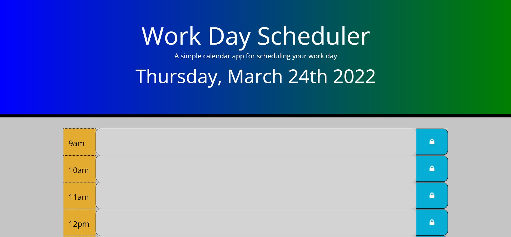

# workday-schedule

# <workday-schedule>

## Description

- Modern style interactive planner that helps manage a complex schedule with ease
- Add schedule events and save them for future reference
- keeps track of the current day and time to help prevent scheduling conflicts

## Table of Contents (Optional)

- [Installation](#installation)
- [Usage](#usage)
- [Credits](#credits)
- [License](#license)

## Installation

URL does not require installation

## Usage

Launch the specified URL to visit the home screen. The current hour block will display red. Past time will display grey while future time will display green. Click on any time block container to input event. Use the save option to the right of the container to save the event for future reference.

    
## Badges

## How to Contribute

please visit https://github.com/julianr3/workday-schedule

